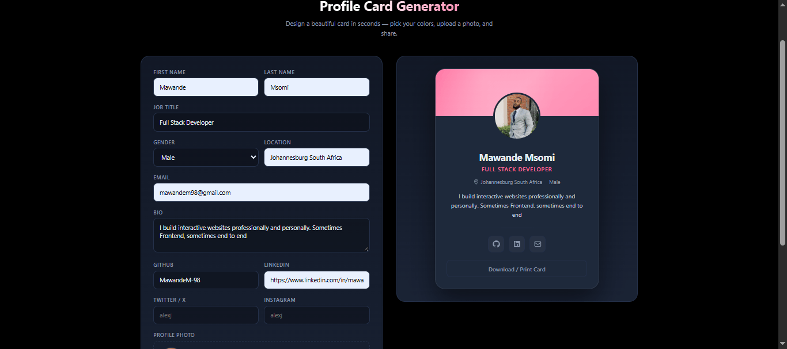

# Profile Card Generator

A single-page app that turns a simple form into a beautifully designed, fully customizable profile card. Pick your colors, upload a photo, add your socials — and generate.

No frameworks. No build step. No backend. Just open `index.html`.

<p align="center">
  
</p>

## ✨ Features

- **Live color customization** — accent, card background, and page background pickers with preset swatches
- **Auto color harmony** — accent color automatically derives a lighter secondary for gradients
- **Smart contrast** — card borders flip between light/dark based on the card color's luminance
- **Photo upload** with instant circular preview
- **Slow heartbeat pulse** — the generate button gently beats like a heart while the card is being generated
- **Animated card reveal** — smooth scale + fade entrance
- **Social links** — GitHub, LinkedIn, Twitter/X, Instagram, and email (only shown if filled)
- **Initials fallback** — shows initials if no photo is uploaded
- **Print / Download** — print-friendly card via the built-in button
- **Fully responsive** — works on desktop, tablet, and mobile
- **Zero dependencies** — pure HTML, CSS, and vanilla JavaScript

## 🛠 Tech Stack

- **HTML5** — semantic structure
- **CSS3** — custom properties (CSS variables), flexbox, grid, `color-mix()`, keyframe animations
- **Vanilla JavaScript** — DOM manipulation, `FileReader` API, dynamic CSS variable updates

## 📁 Project Structure

```
profile-card-generator/
├── index.html       # Markup
├── style.css        # All styles and CSS variables
├── script.js        # App logic and color handling
├── screenshot.png   # Preview image
└── README.md
```

Separated for clarity: structure, presentation, and behavior stay in their own files.

## 🚀 Getting Started

1. Clone the repo:
   ```bash
   git clone https://github.com/MawandeM-98/profile-card.git
   ```
2. Open `index.html` in your browser.

That's it — no install, no server, no dependencies.

## 🎨 How Color Customization Works

The app uses **CSS custom properties** as the single source of truth for theming:

```css
:root {
  --accent: #6d8dff;
  --card-bg: #1a2335;
  --bg: #0b0f17;
}
```

JavaScript updates these variables on `:root`, and every rule that references them updates instantly:

```js
root.style.setProperty('--accent', '#ff6b9d');
```

The accent color also auto-generates a lighter `--accent-2` for gradient endpoints, so a single picker drives the entire color scheme.

## 💓 The Heartbeat Loading State

Instead of a generic spinner, the generate button uses a **slow heartbeat pulse** — a "lub-dub" rhythm that gently scales the button and emits a soft glowing ring every 2.4 seconds. This makes the wait feel intentional and on-brand.

```css
@keyframes heartbeat {
  0%   { transform: scale(1);    box-shadow: 0 0 0 0    /* glow */; }
  15%  { transform: scale(1.03); box-shadow: 0 0 0 12px /* fade */; }
  30%  { transform: scale(1);    box-shadow: 0 0 0 0    /* glow */; }
  45%  { transform: scale(1.03); box-shadow: 0 0 0 12px /* fade */; }
  60%  { transform: scale(1);    box-shadow: 0 0 0 0    /* glow */; }
  100% { transform: scale(1);    box-shadow: 0 0 0 0    /* fade */; }
}
```

Respects `prefers-reduced-motion` — the animation is disabled for users who've opted out of motion in their OS settings.

## 📋 Form Fields

| Field | Required | Notes |
|---|---|---|
| First name | ✅ | |
| Last name | ✅ | |
| Job title | ✅ | e.g. "Frontend Developer" |
| Gender | — | Optional dropdown |
| Location | — | |
| Email | — | Renders as a mail icon |
| Bio | — | Max 160 characters |
| GitHub / LinkedIn / Twitter / Instagram | — | Handles only; icons appear if filled |
| Photo | — | Falls back to initials |

## 🖼 Customization Options

- **Accent color** — drives the banner gradient, job title, button, focus rings, header logo, and social hover states
- **Card color** — sets the card background and avatar border
- **Page background** — sets the full page background with a smooth transition
- **Preset swatches** — quick-access color dots under each picker

## 📱 Responsive Breakpoints

- **≤ 900px** — form and preview stack vertically
- **≤ 560px** — compact panel padding, single-column inputs, taller touch targets, smaller card
- **≤ 360px** — extra-small phone tweaks

## 🗺 Roadmap

- [ ] Preset themes (Midnight, Sunset, Minimal Light)
- [ ] Real PNG download via `html2canvas`
- [ ] Multiple card templates
- [ ] Font picker
- [ ] Rounded corner slider
- [ ] Save/load profiles to `localStorage`

## 🤝 Contributing

Contributions, issues, and feature requests are welcome. Feel free to open an issue or submit a PR.

## 📄 License

MIT — free to use, modify, and distribute.

## 🙏 Acknowledgements

- Icons: inline SVGs (no external library)
- Font: system font stack (`Inter`, `system-ui`)

---

Built as a beginner-friendly single-page app project. ⭐ Star it if you found it useful!